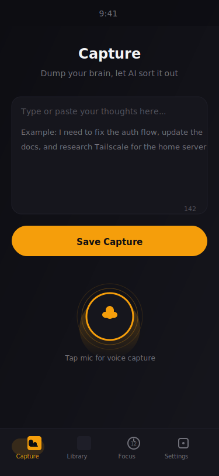
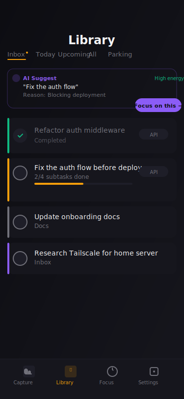
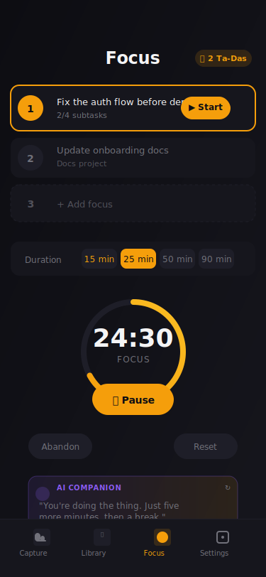
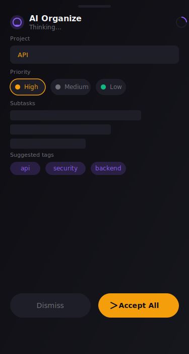
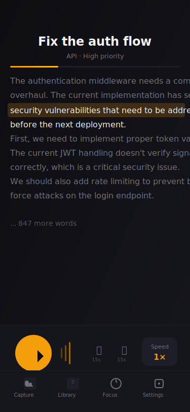

# InCheck

<div align="center">

**Your brain's external RAM** — capture thoughts, let AI organize them, get things done.

Built for ADHD brains that think faster than they can type.

[](https://opensource.org/licenses/MIT)
[](CONTRIBUTING.md)
[](https://vitejs.dev)
[](https://react.dev)
[](https://web.dev/progressive-web-apps/)
[](https://ollama.com)

**[Live Demo](#-live-demo)** · **[Quick Start](#-quick-start)** · **[Features](#-features)** · **[Documentation](#-documentation)** · **[Self-Hosting](#-self-hosting)**

</div>

---

## ✨ What is InCheck?

InCheck is a local-first PWA designed as **external RAM for your brain**. Think of it as a notepad that's always listening, where every thought gets instantly organized into something actionable.

> **The problem:** Ideas evaporate before you can type them. Tasks pile up unstructured. Your brain is constantly juggling 47 things and can't find the signal.

> **The solution:** Capture first, organize second. InCheck takes your raw rambling and structures it — projects, priorities, subtasks — using a local AI that knows your context.

### The Core Loop

```
💭 Thought strikes
    ↓
🎤 Tap mic → speak freely
    ↓
🤖 AI organizes → projects, tasks, priorities
    ↓
🎯 Add to Focus → get it done
    ↓
✅ Ta-Da! → dopamine hit, item complete
```

### Who is it for?

- **ADHD brains** who think in streams, not bullet points
- **Knowledge workers** drowning in half-formed ideas
- **Developers** who think faster than they type
- **Writers and creators** who need to capture without breaking flow
- **Anyone** who forgets things the moment they stop thinking about them

### What makes it different?

| Typical apps | InCheck |
|---|---|
| Structure before capture | Dump first, organize after |
| Cloud-first (privacy risk) | 100% local-first, works offline |
| Guilt-inducing streaks | No punishment, just vibes |
| Generic AI | Local LLM that knows *your* context |
| Complex navigation | 4 tabs, 2-tap capture |

---

## 🎯 Live Demo

> **Note:** InCheck uses **local AI** (runs on your own machine). The demo shows the UI — AI features require a local LLM setup (Ollama).

**No account. No cloud. No data leaving your devices.**

---

## 🚀 Quick Start

### Prerequisites

- **Node.js** 18+ — [download](https://nodejs.org/)
- **Ollama** running locally — [install](https://ollama.com/download)

### 1. Install Ollama (one-time)

```bash
# macOS/Linux
curl -fsSL https://ollama.com/install.sh | sh

# Pull a model
ollama pull mistral:7b
```

### 2. Run InCheck

```bash
git clone https://github.com/yourusername/incheck.git
cd incheck
npm install
npm run dev
```

Open [http://localhost:5173](http://localhost:5173)

### 3. Connect AI

Open **Settings → AI Services** — it auto-detects Ollama. If the status shows "connected", you're ready.

That's it. No API keys. No accounts.

---

## 📱 Features

### 🎤 Voice Capture

**Zero-friction capture.** Two taps to start. Up to 10 minutes of continuous rambling.

- Tap mic → speak → tap stop
- Live transcription as you talk
- Auto-saves as a capture item
- Works offline once loaded

### 🧠 AI Organization

**Your rambling, structured.** Ollama extracts projects, priorities, subtasks, and tags — in real-time streaming.

- See suggestions appear as AI "thinks"
- Subtask breakdown — "organize garage" becomes 5 concrete steps
- Smart tagging based on your content patterns
- Rate-limited updates — smooth UI, no thrashing

### 📚 Library

**Everything in one place.** Inbox → Today → Upcoming → All → Parking.

- Full-text search across all captures
- Filter by type: ideas, voice, documents
- Swipe to complete or defer
- AI smart suggestions in the Inbox tab
- Priority indicators with color-coded dots

### ⏱️ Focus Mode

**One task. One timer. Dopamine on completion.**

- Pick your 3 daily focuses (constraint is intentional)
- Pomodoro timer with customizable durations (15/25/50/90 min)
- Resistance tracker — log how you're feeling (😤 → 😐 → 🥱)
- **AI Companion** (optional) — gentle nudges from your local LLM
- Ta-Da! celebration on completion → confetti → item marked done

### 🔊 Listen (TTS)

**Hands-free reading.** Any capture, any document — listened to while your hands stay free.

- **Kokoro TTS** (local Pi 5, free, MOS 4.2 quality)
- **fal.ai** cloud fallback (free tier, no setup)
- **Web Speech API** last resort (works everywhere)
- Speed control: 0.5× → 3×
- Synced highlighting — follow along as it reads
- Sleep timer, bookmarks, background playback

---

## 📖 Documentation

### The Capture Flow

```
💭 Idea strikes
     ↓
📱 Open InCheck (or tap from home screen)
     ↓
🎤 Tap mic → speak freely
     ↓
💾 Tap stop → auto-saves
     ↓
🤖 Tap "Organize" → AI extracts structure
     ↓
✅ Accept suggestions → task ready
     ↓
🎯 Add to Focus → get it done
```

### Focus Mode Deep Dive

The **3-focus constraint** is intentional — it's based on ADHD research on task paralysis:

```
┌─────────────────────────────────────┐
│  Pick your 3 focuses                │
│                                     │
│  ■ 1. Fix auth middleware           │
│  ■ 2. Write project docs            │
│  □ 3. + Add focus                  │
│                                     │
│  Duration: [15] [25] [50] [90]      │
│                                     │
│  [ Start Focus → ]                  │
└─────────────────────────────────────┘
```

During a session:
- Timer counts down with animated ring
- Resistance face picker (😤 → 😐 → 🥱)
- Optional AI companion message (appears 3s after start)
- Ta-Da! on completion → confetti → item marked done

### AI Companion Messages

When **Focus Companion** is enabled in Settings, InCheck fetches brief encouragement from your local LLM:

- **Work phase:** "You're doing the thing. Just five more minutes."
- **Break phase:** "You earned this. Let your brain decompress."
- **Stuck phase:** "Start anywhere. Not everywhere."

Messages are short (1-3 sentences), ADHD-friendly, never preachy.

### Smart Suggester

In the **Library → Inbox** tab, an AI-powered card shows:

```
┌──────────────────────────────────┐
│ 🤖 AI Suggest                    │
│                                  │
│ "Fix the auth flow"              │
│ Reason: Blocking deployment       │
│ Energy: High                    │
│                                  │
│ [ Focus on this → ]             │
└──────────────────────────────────┘
```

The model analyzes your captures and picks the most important next action based on context, urgency, and energy cost.

---

## 🏗️ Architecture

### Tech Stack

| Layer | Technology | Why |
|-------|-----------|-----|
| **Framework** | React 18 + Vite | Fast HMR, PWA-ready |
| **State** | Zustand | Minimal boilerplate, persist middleware |
| **Storage** | IndexedDB + localStorage | Offline-first, no server |
| **AI (LLM)** | Ollama | Local, private, free |
| **AI (TTS)** | Kokoro + fal.ai + Web Speech | Quality → fallback chain |
| **PWA** | vite-plugin-pwa + Workbox | Installable, offline |

### Key Files

```
src/
├── lib/
│   ├── llmService.js      ← Ollama integration (streaming, organize, suggest)
│   ├── ttsService.js      ← TTS backends (Kokoro, fal, Web Speech)
│   └── aiOrganize.js      ← Client-side AI helpers
├── stores/
│   └── captureStore.js   ← Zustand store (items, settings, persistence)
├── components/
│   ├── BrainDumpInput.jsx ← Main capture screen
│   ├── Library.jsx        ← Item management + search
│   ├── Focus.jsx          ← Pomodoro + AI companion
│   ├── TTSReader.jsx      ← Listen screen
│   ├── AIOrganizeSheet.jsx ← AI suggestion sheet
│   └── AISuggest.jsx      ← Smart suggester card
├── hooks/
│   └── useReducedMotion.js ← Accessibility hook
└── App.jsx                ← Root component + routing
```

### Local-First Design

```
┌─────────────────┐      ┌─────────────────┐
│   Your Browser  │      │   Your Pi 5     │
│                 │      │                 │
│  ┌───────────┐  │      │  ┌───────────┐  │
│  │  InCheck  │  │ ←──→ │  │  Ollama   │  │
│  │    PWA    │  │      │  │  (LLM)    │  │
│  └───────────┘  │      │  └───────────┘  │
│       ↓         │      │       ↓         │
│  ┌───────────┐  │      │  ┌───────────┐  │
│  │ IndexedDB │  │      │  │  Kokoro   │  │
│  │ (offline) │  │      │  │  (TTS)    │  │
│  └───────────┘  │      │  └───────────┘  │
└─────────────────┘      └─────────────────┘
         ↓
   Phone/Tablet/Desktop
   (no cloud, no account)
```

**No data leaves your devices.** Everything stays local.

---

## 🖥️ Self-Hosting

InCheck is designed to run on a home server (like a Raspberry Pi 5) so you can access it from anywhere via Tailscale.

### Full Home Server Setup

```
Internet
    ↓
Tailscale VPN (your private network)
    ↓
┌─────────┐    ┌─────────────┐    ┌──────────────┐
│  Phone  │ ←→ │   Pi 5      │ ←→ │   Ollama     │
│  (app)  │    │  (server)   │    │   + Kokoro   │
└─────────┘    └─────────────┘    └──────────────┘
                    ↓
              Serve InCheck
              (any static host)
```

### 1. Set Up Tailscale on Pi

```bash
# On your Pi
curl -fsSL https://tailscale.com/install.sh | sh
tailscale up --accept-dns
```

Note your Tailscale address (e.g., `my-pi.tail3c4.ts.net`).

### 2. Configure InCheck Settings

In **Settings → AI Services**:

- **Ollama URL:** `http://my-pi.tail3c4.ts.net:11434`
- **Kokoro URL:** `http://my-pi.tail3c4.ts.net:8080`

### 3. Serve InCheck (Optional)

For non-local access, serve the built app from your Pi:

```bash
cd ~/incheck
npm run build
npx serve dist -p 3000
```

Access at `http://my-pi.tail3c4.ts.net:3000`

---

## 🎨 Screenshots

### Capture Screen
> The voice-first brain dump interface. Tap the mic, ramble, done.



### Library
> Everything organized, searchable, filterable.



### Focus Mode
> Pick your 3, start the timer, get it done.



### AI Organize
> Streaming suggestions from your local LLM.



### Listen
> Read anything aloud, hands-free.



---

## 🧪 Development

### Available Scripts

```bash
npm run dev      # Start dev server (localhost:5173)
npm run build    # Build for production
npm run preview  # Preview production build
```

### Environment Variables

InCheck uses **zero environment variables** by default. Everything is configured through the in-app Settings UI and stored in localStorage.

---

## 🤝 Contributing

Contributions welcome! Whether it's bug fixes, features, or documentation.

### Getting Started

```bash
# Fork → Clone → Install
git clone https://github.com/YOUR_USERNAME/incheck.git
cd incheck
npm install

# Create a branch for your change
git checkout -b feature/your-feature

# Make your changes, then
npm run build   # Must pass

# Commit and push
git push origin feature/your-feature

# Open a Pull Request
```

### What to Contribute?

| Area | Ideas |
|------|-------|
| **AI Features** | Better prompts, smarter suggestions, energy tracking |
| **TTS** | Additional voice options, pronunciation dictionary |
| **UI/UX** | Animations, micro-interactions, themes |
| **Accessibility** | WCAG audits, screen reader testing |
| **Documentation** | Guides, tutorials, videos |

---

## 📋 Roadmap

See [docs/ROADMAP.md](docs/ROADMAP.md) for full details.

### Completed ✅
- [x] PWA installable, works offline
- [x] Voice capture with transcription
- [x] AI task extraction via Ollama (local LLM)
- [x] TTS playback with Kokoro
- [x] Focus mode with Pomodoro
- [x] AI companion messages
- [x] Smart task suggester
- [x] Accessibility audit
- [x] Local-first storage

### In Progress 🚧
- [ ] PDF/EPUB parsing
- [ ] Energy tracking dashboard
- [ ] Custom pronunciation dictionary

### Backlog 📋
- [ ] ElevenLabs premium voices
- [ ] Apple Watch companion
- [ ] Collaborative "Patch" shared spaces
- [ ] Widgets (iOS/Android)

---

## 🧬 Philosophy

> **"Calm. Non-judgmental. No guilt spirals. Just vibes and getting things done."**

InCheck is built on five principles:

1. **Zero friction capture** — If it takes > 2 seconds, you won't do it
2. **Structure after chaos** — Dump first, organize after, not the other way around
3. **Local-first privacy** — Your thoughts are yours, not a startup's data
4. **No punishment mechanics** — Streaks are toxic for ADHD brains
5. **AI as assistant, not replacement** — Your brain does the thinking, AI does the organizing

---

## 📄 License

MIT License — see [LICENSE](LICENSE)

---

## 🙏 Acknowledgments

- [Ollama](https://ollama.com) — Local LLM made accessible
- [Kokoro TTS](https://github.com/hexgrad/kokoro) — High-quality open TTS
- [Vite](https://vitejs.dev) — Fast, modern build tool
- [Zustand](https://zustand-demo.pmnd.rs) — Delightful state management
- [Lucide](https://lucide.dev) — Beautiful, consistent icons

---

<div align="center">

**Your brain's external RAM.**

*Built with Vite + React + local AI ❤️*

</div>